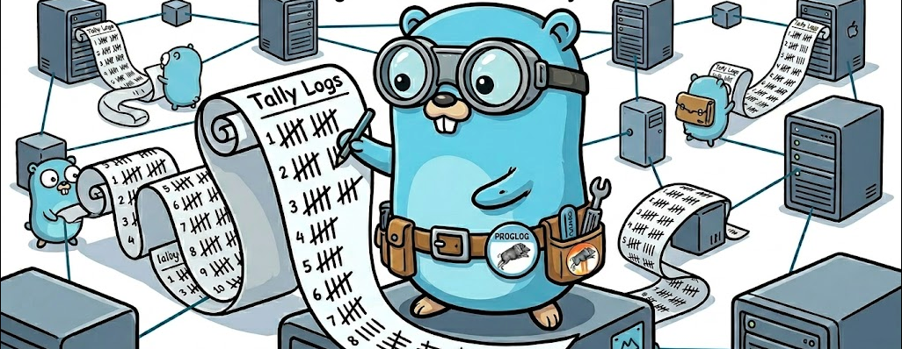
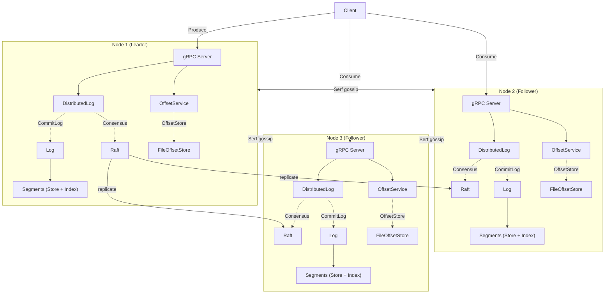

 # Tally        

  

## Problem

Travis Jeffery's [proglog](https://github.com/travisjeffery/proglog) teaches the right patterns but is frozen at Go 1.13 with deprecated dependencies.

## Solution

Tally is the spiritual successor — a single-topic distributed commit log written for Go 1.23+ with observability designed in. Single binary. Zero cloud dependencies.

- **Log-structured storage** — append-only store with memory-mapped index, segmented for rotation and retention
- **gRPC API** — Produce, Consume, streaming RPCs, and consumer offset tracking 
- **Raft consensus** — leader accepts writes, followers serve reads, automatic failover
- **Serf discovery** — gossip-based cluster membership
- **mTLS + ACL** — mutual TLS authentication with Casbin policy authorization
- **OpenTelemetry** — traces and metrics on every operation, structured logging with trace correlation
- **Deterministic simulation testing** — fault-injecting transport and store wrappers with seed-based reproducibility
- **CLI** — produce, consume, and cluster inspection from the command line

## Architecture

Writes go to the Raft leader. Reads are served by any node. Serf gossip handles cluster membership. Each node's local log is an ordered set of segments, each pairing an append-only store file with a memory-mapped index.

## Usage

Coming soon!
